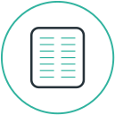
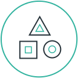

No keynotes, expo halls or talks.

Only discussions about getting more&nbsp;resources to
 support digital&nbsp;infrastructure.

<ul class="nav">
  <li><a href="agenda.html"> Agenda</a></li>
  <li><a href="about.html"> About</a></li>
</ul>

  <button>Buy Tickets</button>
  
(<b>19</b> remaining)

<a id="hashtag" href="https://twitter.com/hashtag/dollarsignustain">#dollarsignustain</a>

<section id="more-info">
  <ul class="nav">
    <li><a href="sponsor.html"> Sponsor</a></li>
    <li><a href="code-of-conduct.html"> Code of Conduct</a></li>
    <li><a href="diversity.html"> Diversity</a></li>
  </ul>
  

</section>
